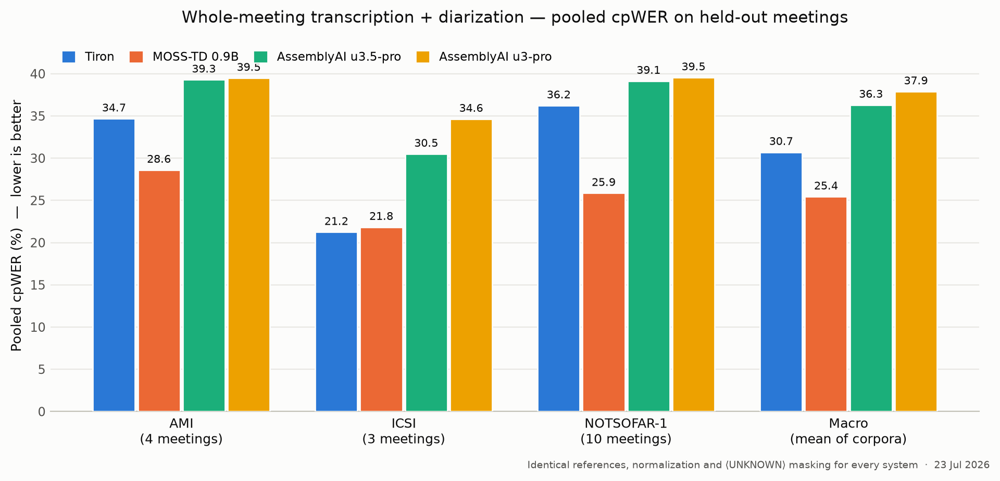

# Tiron

*Released 21 July 2026.*

Reference inference harness for [Trelis/tiron](https://huggingface.co/Trelis/tiron), a multi-speaker meeting transcription model (Whisper large-v3 architecture with inline `<|speakerN|>` speaker tokens, up to 8 speakers).

The harness turns the model's 30-second windows into whole-meeting transcripts:

1. **Chunking** — fixed 30s windows with a 0.75s onset guardrail.
2. **Decoding** — greedy transformers decoding of each window into speaker-tagged, timestamped segments.
3. **Speaker linking** — ECAPA voice embeddings link window-local speakers into stable meeting-level identities, with a second staggered decode pass (on by default) that calibrates the clustering threshold per meeting.

Among systems that reliably transcribe entire meetings, Tiron leads every test set we evaluated. Its closest such rival, AssemblyAI `universal-3-pro`, trails on every corpus (pooled corpus cpWER, same references and scoring, lower is better): AMI 35.24 vs 39.49, ICSI 20.91 vs 34.64, NOTSOFAR-1 37.55 vs 38.62. Details and meeting IDs on the [model card](https://huggingface.co/Trelis/tiron).



This harness uses the same grammar-constrained decoding as Trelis' hosted serving by default (disable with `--no-constrained-decoding` / `constrained_decoding=False`).

## How the speaker linking works

The model only hears 30 seconds at a time and numbers speakers locally (speaker 1, 2, 3…), restarting every window — so on its own it can't follow a person across a meeting. The harness's real job is to stitch those windows into one consistent set of speakers. It does this in two moves:

1. **Build a spine from the audio it's confident about.** Only clean, long, non-overlapping speech gets a say in *who the real speakers are*. Each such segment gets an [ECAPA](https://huggingface.co/speechbrain/spkrec-ecapa-voxceleb) voice embedding, and those are clustered into the meeting's speakers. A second, offset decoding pass **calibrates** this: it measures how similar two voiceprints must be to count as the same person in *this* meeting (far-field audio needs a looser bar than any fixed threshold), and adds guardrails so two people who provably talk at the same time can't be merged into one.

2. **Fold in the leftovers.** Short or overlapping speech that didn't make the spine is then *attached* to the nearest spine speaker — by voiceprint first, falling back to timing (who was speaking nearby) when the voice match is inconclusive.

The idea is that speaker-attribution errors are contagious: if noisy, overlapping audio helped *define* the speaker set, one bad voiceprint would spawn a phantom speaker and real speech would get misrouted to it. By deciding the cast of speakers from high-confidence audio first and only then attaching the messy bits, a noisy fragment can at worst be misattributed — it can never invent a speaker or corrupt the roster.

## Install

```bash
pip install -e .        # or: uv pip install -e .
```

Requires Python ≥3.10. CUDA, Apple Silicon (MPS), and CPU are supported (auto-detected).

## CLI

```bash
tiron meeting.wav                                  # JSON to stdout
tiron meeting.wav --format text                    # readable transcript
tiron meeting.wav --format srt --output out.srt    # subtitles (also: vtt)
tiron meeting.wav --language auto --max-speakers 4
```

## Python

```python
from tiron import TironEngine

engine = TironEngine()  # loads Trelis/tiron; pass hf_token=... if needed
result = engine.transcribe("meeting.wav", language="auto")

for seg in result["segments"]:
    print(f'[{seg["start"]:7.2f}-{seg["end"]:7.2f}] {seg["speaker"]}: {seg["text"]}')
```

`result` contains `segments` (each `{"speaker": "SPEAKER_00", "start", "end", "text"}` on the original file timeline), `speakers`, `language`, `duration`, and `two_pass` diagnostics.

## Tests

```bash
uv run --with pytest --with numpy pytest tests/ -q
```

## License

Apache 2.0.
